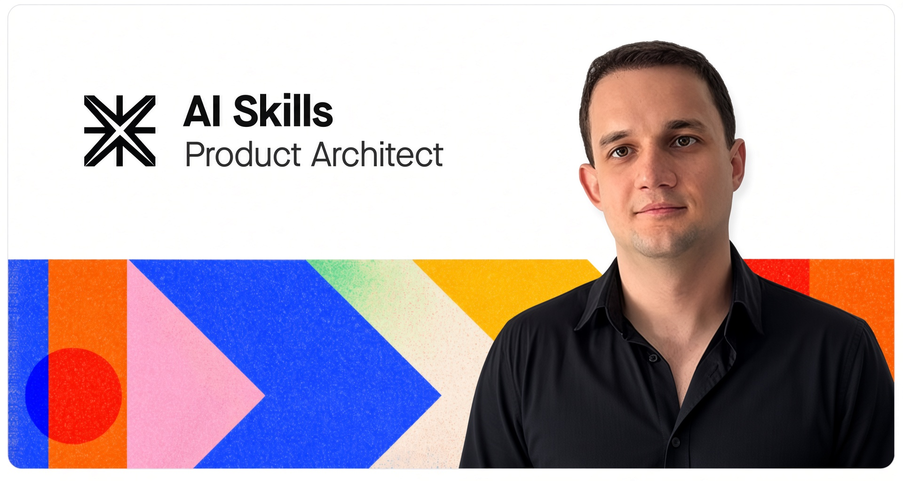
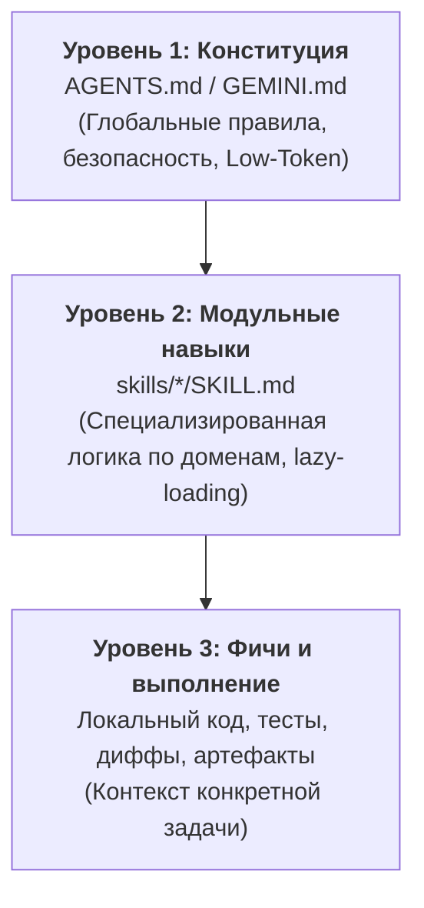

<div align="center">



# 🧠 PersonalOS: The Agentic OS & Skill Ecosystem

**Production-grade библиотека навыков, мета-фреймворков и стандартов для автономных ИИ-агентов**<br>
*Created & curated by [Alexey Proshinsky](https://proshinsky.com)*<br>
*Совместимо с Google Antigravity, Claude Code, Cursor, OpenAI Codex, Windsurf и Cline.*

[](https://agentskills.io/)
[](public/skill-ops/skillspector/SKILL.md)
[](public/ai/low-toten/SKILL.md)
[-8b5cf6.svg)](frameworks/gsd-core/)
[](https://opensource.org/licenses/MIT)

[Каталог навыков](#-каталог-навыков-skills) • [Фреймворки](#-системные-фреймворки-frameworks) • [Шлюз безопасности](#-шлюз-безопасности-skill-pre-install-gate) • [Быстрый старт](#-быстрый-старт-и-подключение) • [Конституция](#-конституция-проекта-agentsmd)

</div>

---

## 📌 О проекте

**PersonalOS** — это комплексная операционная среда для автономных кодинг-агентов. Репозиторий превращает разрозненные LLM-сессии в предсказуемый инженерный конвейер благодаря:
1. **78 специализированным исполняемым навыкам (`skills/`)**, структурированным по 13 функциональным доменам.
2. **Системным мета-фреймворкам (`frameworks/`)**, обеспечивающим Spec-Driven Development (SDD), Test-Driven Development (TDD) и изоляцию контекста (до 200k токенов на микрозадачу без деградации).
3. **Строгому шлюзу безопасности** на базе статического YARA/AST и семантического анализатора **NVIDIA SkillSpector**.
4. **Протоколу Low-Token**, сокращающему паразитный оверхед промптов и контекста более чем на 35%.

---

## 🏛 3-Уровневая архитектура контекста

PersonalOS организует знания агентов по строгой иерархии:



---

## 🛡 Шлюз безопасности (Skill Pre-Install Gate)

Каждый внешний навык перед добавлением в `skills/` проходит обязательный аудит через встроенный шлюз **NVIDIA SkillSpector**:
- **Изоляция:** Клонирование исключительно в песочницу `/tmp/`. Прямое скачивание в рабочее дерево запрещено.
- **Статический скан:** YARA-сигнатуры, AST-анализ опасных системных вызовов (`eval`, `subprocess`, скрытые curl/sh, обфусцированный Base64).
- **Политика вердиктов:**
  - `APPROVE` — чистый аудит (0 CRITICAL / HIGH находок). Разрешена установка.
  - `CAUTION` — обнаружены сетевые запросы или шелл-команды. Требуется явное одобрение пользователя.
  - `REJECT` — prompt-injection, скрытая эксфильтрация данных или бэкдоры. Установка блокируется.

---

## 📦 Каталог навыков (`skills/`)

### 1. 🛠 Разработка и Инженерия (Development & Engineering)
*Директория:* [`public/dev/`](public/dev/)

| Навык | Назначение и возможности | Стек / Формат |
| :--- | :--- | :--- |
| [**`adhd`**](public/dev/adhd/SKILL.md) | **Parallel Divergent Ideation**. Исследование решений под 5 когнитивными фреймами (Biology, Speedrunner, Regulator, 10yo, $0 budget), отсеивание ловушек и углубление гипотез. | Node/CLI |
| [**`ai-software-factory`**](frameworks/ai-software-factory/SKILL.md) | **Автономная фабрика софта («Dark Factory»)**. Полный беспилотный цикл: Issue → Mission Gate → Plan → Build → Изолированный Judge → Holdout E2E → Auto-Merge. | Python / CLI |
| [**`code-reviewer`**](public/dev/code-reviewer/SKILL.md) | **Total Review Engine v2.1.0**. Двухпроходный консенсусный аудит кода (Claude + OpenAI Codex CLI), фильтрация придирок (Overthinking Rejection) и Approval Gate. | Prompt / CLI |
| [**`codex-plugin-cc`**](public/dev/codex-plugin-cc/SKILL.md) | **OpenAI Codex CLI Suite**. Официальный пакет интеграции Codex CLI: headless-сессии исполнения, валидация git-диффов, рецепты reasoning для GPT-5.4. | Node/CLI |
| [**`supabase`**](public/dev/supabase/SKILL.md) | **Supabase & Postgres Suite**. Официальный агентный пакет Supabase: Database, Auth, RLS-политики, Edge Functions, Storage, SSR (Next.js/React) и оптимизация PostgreSQL. | Node/CLI |
| [**`gnhf`**](public/dev/gnhf/SKILL.md) | **Good Night, Have Fun Orchestrator**. Оркестратор длительных автономных ночных прогонов до достижения естественного stop condition. | Node/CLI |
| [**`no-mistakes`**](public/dev/no-mistakes/SKILL.md) | **Pre-Commit Quality Gate**. Локальный гейт-прокси, линтинг и валидация правок без регрессий перед коммитом. | Prompt |
| [**`git-worktree`**](public/dev/git-worktree/SKILL.md) | **Параллельная разработка в Git**. Управление изолированными ветками worktree без переключения контекста и git stash. | Prompt |
| [**`diy-mcp-connector`**](public/dev/diy-mcp-connector/SKILL.md) | **Генератор MCP-серверов**. Создание локальных MCP-адаптеров к веб-сайтам через реверс-инжиниринг HAR и CDP. | Python / Node |
| [**`sgr-core`**](public/dev/sgr-core/SKILL.md) | **SGR Agent Core**. Архитектура построения сложных многоагентных и reasoning-систем. | Prompt |
| [**`shadcn`**](public/dev/shadcn/SKILL.md) | **shadcn/ui Manager**. Интеграция, генерация компонентов и управление дизайн-токенами Tailwind CSS. | Node/CLI |
| [**`magicui`**](public/dev/magicui/SKILL.md) | **Interactive UI Library**. Эффектные React/Next.js компоненты: частицы, глобусы, marquee и micro-interactions. | Node/CLI |
| [**`react-native-skills`**](public/dev/react-native-skills/SKILL.md) | **React Native & Expo Standards**. Оптимизация 60fps производительности мобильных приложений. | Node/CLI |
| [**`mobile`**](public/dev/mobile/SKILL.md) | **Mobile Design Master Hub**. UX-шаблоны лучших приложений (Airbnb, Revolut) + Material Design 3. | Node/CLI |
| [**`open-graph`**](public/dev/open-graph/SKILL.md) | **OG & Social Meta Generator**. Генерация динамических превью и метаданных для поисковых систем. | Prompt |
| [**`vercel-automation`**](public/dev/vercel-automation/SKILL.md) | **Vercel Automation MCP**. Управление проектами, доменами, переменными окружения и деплоями. | Prompt |

---

### 2. 🤖 Автоматизация, Воркфлоу и Интеграции (Automation & Agents)
*Директория:* [`public/automation/`](public/automation/)

| Навык | Назначение и возможности | Стек / Формат |
| :--- | :--- | :--- |
| [**`Browser-automation`**](public/automation/Browser-automation/SKILL.md) | **Headless Browser CDP Engine**. Высокоскоростное управление браузером (скриншоты, клики, навигация, парсинг данных). | Node/CLI |
| [**`n8n-architect`**](public/automation/n8n-architect/SKILL.md) | **n8n Workflow Architect**. Проектирование, дебаг, валидация и оптимизация сценариев автоматизации n8n. | Prompt |
| [**`n8n-as-code`**](public/automation/n8n-as-code/SKILL.md) | **n8n-as-Code Engine**. Синхронизация, импорт/экспорт и версионирование сценариев в JSON-формате прямо из git. | Node/CLI |
| [**`n8n-official`**](public/automation/n8n-official/SKILL.md) | **Official n8n Knowledge Suite**. Полная справочная база знаний по всем 14 аспектам узлов, выражений и субагентов n8n. | Node/CLI |
| [**`linear-automation`**](public/automation/linear-automation/SKILL.md) | **Linear Automation MCP**. Синхронизация бэклога, задач, спринтов и проектных циклов. | Prompt |
| [**`googlesheets-automation`**](public/automation/googlesheets-automation/SKILL.md) | **Google Sheets Manager**. Чтение, модификация, формулы и пакетный экспорт таблиц Google Sheets. | Prompt |
| [**`modal-cloud`**](public/automation/modal-cloud/SKILL.md) | **Modal Cloud Serverless Compute**. Запуск тяжелых Python/ML вычислений на GPU в облаке. | Python |
| [**`xlsx`**](public/automation/xlsx/SKILL.md) | **Spreadsheet Engine**. Профессиональная обработка локальных файлов Excel (парсинг, формулы, форматирование). | Python |
| [**`self-improving-workflow`**](public/automation/self-improving-workflow/SKILL.md) | **Self-Improving Loop**. Петли обратной связи и самообучение автоматизированных пайплайнов на ошибках. | Python |
| [**`second-brain`**](public/automation/second-brain/SKILL.md) | **Second Brain Sync**. Синтез заметок и связывание концепций в персональную вики. | Prompt |

---

### 3. 👤 Личная продуктивность и База знаний (Personal & PKM)
*Директория:* [`public/personal/`](public/personal/)

| Навык | Назначение и возможности | Стек / Формат |
| :--- | :--- | :--- |
| [**`claude-obsidian`**](public/personal/claude-obsidian/SKILL.md) | **Compounding Knowledge System (15 навыков)**. Полноценная среда для Obsidian: сохранение источников, claim-first grounding, Canvas-карты, autoresearch и линтинг хранилища. | Python / Node/CLI |
| [**`obsidian-git`**](public/personal/obsidian-git/SKILL.md) | **Obsidian Git Sync**. Автоматический периодический бэкап, коммит и синхронизация хранилищ заметок через Git. | Python / Node |
| [**`book-to-skill`**](public/personal/book-to-skill/SKILL.md) | **Book-to-Skill Transformer**. Конвертация книг, руководств и методологий в исполняемые спецификации навыков агента. | Python |

---

### 4. 📦 Продуктовый менеджмент и PRD (Product Management)
*Директория:* [`public/product/`](public/product/)

| Навык | Назначение и возможности | Стек / Формат |
| :--- | :--- | :--- |
| [**`prd-taskmaster`**](public/product/prd-taskmaster/SKILL.md) | **Atlas Engine v5.3.0**. Комплексная декомпозиция PRD: 33 модуля Python, фазы Discover → Generate → Handoff, CLI `taskmaster`. | Python / CLI |
| [**`advise-project-approach`**](public/product/advise-project-approach/SKILL.md) | **Tech Stack & Architecture Advisor**. Выбор оптимального стека и архитектуры на основе анализа аналогов (comparables). | Python |
| [**`AJTBD`**](public/product/AJTBD/SKILL.md) | **Applied JTBD Framework**. Детальный анализ Jobs-To-Be-Done: микро-шаги, барьеры, job stories и эмоциональные триггеры. | Prompt |

---

### 5. 🎨 UI/UX и Дизайн-системы (Design & UI/UX)
*Директории:* [`public/UX/`](public/UX/) и [`public/design/`](public/design/)

| Навык | Назначение и возможности | Стек / Формат |
| :--- | :--- | :--- |
| [**`awesome-design-skills`**](public/design/awesome-design-skills/SKILL.md) | **Каталог 67 Дизайн-систем**. Готовые пресеты стилей: Bento, Glassmorphism, Brutalism, Futuristic, Retro и др. | Node/CLI |
| [**`better-interface`**](public/design/better-interface/SKILL.md) | **Interface Inspector & Reviewer**. Комплексный аудит верстки, доступности (WCAG), типографики, палитр и стресс-тест состояний (`break`). | Prompt |
| [**`design-audit`**](public/design/design-audit/SKILL.md) | **AXD & Design Audit Suite**. 42 академических навыка Agentic Experience Design (эвристики Нильсена, генеративный UI, калибровка тональности). | Prompt |
| [**`design-top100`**](public/design/design-top100/SKILL.md) | **Design Top-100 & Creative Suite**. 130+ навыков от MengTo: Awwwards-стили, Three.js 3D/шейдеры, Bento, детекторы AI-slop, видео-в-суперпромпт. | Node/CLI |
| [**`garden-skills`**](public/design/garden-skills/SKILL.md) | **Garden Skills Suite**. Пакет визуального инжиниринга от ConardLi: верстка интерфейсов, 16:9 интерактивные клик-презентации, статьи reacticle. | Python / Node/CLI |
| [**`GSAP`**](public/design/GSAP/SKILL.md) | **GSAP Animation Suite**. 60fps анимации: ScrollTrigger, MorphSVG, Flip и сложные таймлайны. | Node/CLI |
| [**`hallmark`**](public/UX/hallmark/SKILL.md) | **Anti-AI-Slop Design Engine**. Генерация нетривиальных UI/лендингов, аудит визуального стиля, устранение шаблонного ИИ-дизайна. | Node/CLI |
| [**`landing-page-design`**](public/design/landing-page-design/SKILL.md) | **High-Converting Landing Page System**. Фреймворк конверсионных посадочных страниц от elayadesign: intake, оффер, копирайтинг и дизайн-токены. | Prompt |
| [**`nano-banana`**](public/design/nano-banana/SKILL.md) | **Visual Asset Generator**. Генерация иллюстраций и промо-графики под заданный арт-дирекшн. | Python / Node |
| [**`scroll-craft`**](public/design/scroll-craft/SKILL.md) | **Scroll-Driven Website Engine**. Кинематографичные сайты с плавной скролл-анимацией: 3D-глубина, покадровое движение, адаптивность. | Node/CLI |
| [**`static-banner`**](public/design/static-banner/SKILL.md) | **Banner Design Engine**. Создание статических промо-баннеров и креативов по модульной сетке. | Prompt |
| [**`tastemaker`**](public/design/tastemaker/SKILL.md) | **Anti-AI Design & Taste Engine**. Устранение AI-шаблонов, локальный расчет контраста WCAG (`check_contrast.py`), гармоничные палитры и style-lock. | Python / CLI |
| [**`ui-ux-pro-max`**](public/UX/ui-ux-pro-max/SKILL.md) | **UI/UX Design Master Suite**. Комплексное проектирование дизайн-систем, баннеров, слайдов и UI-компонентов. | Python / Node/CLI |

---

### 6. ✍️ Тексты, Копирайтинг и Де-слоппинг (Writing & Anti-Slop)
*Директория:* [`public/writing/`](public/writing/)

| Навык | Назначение и возможности | Стек / Формат |
| :--- | :--- | :--- |
| [**`humanizer-ru`**](public/writing/humanizer-ru/SKILL.md) | **Russian Text Humanizer (72 правила)**. Очеловечивание русскоязычного текста, удаление канцелярита, штампов и водянистости ИИ. | Python / Node/CLI |
| [**`humanizer-en`**](public/writing/humanizer-en/SKILL.md) | **English Text Humanizer**. Устранение маркеров ИИ («delve», «tapestry», «testament») в англоязычных текстах. | Prompt |
| [**`simple-english`**](public/writing/simple-english/SKILL.md) | **Simplified Technical English (ASD-STE100)**. Лаконичная техническая документация без двусмысленности для международных команд. | Python / Node/CLI |
| [**`slop-monster`**](public/writing/slop-monster/SKILL.md) | **Ultimate AI Slop Remover**. Бескомпромиссное устранение клише, пустых преамбул и канцелярского тона нейросетей. | Python / Prompt |

---

### 7. 🔬 Исследования, Анализ и SOTA (Research & Intelligence)
*Директория:* [`public/research/`](public/research/)

| Навык | Назначение и возможности | Стек / Формат |
| :--- | :--- | :--- |
| [**`neuroarxiv`**](public/research/neuroarxiv/SKILL.md) | **ArXiv Prior-Art Research Engine**. Анализ научной литературы arXiv перед проектированием архитектур и алгоритмов. | Prompt / HTTP |
| [**`HeroesGPT`**](public/research/HeroesGPT/SKILL.md) | **Strategic Market Research v7.0**. Комплексное исследование рынка, сегментов ЦА, болей и формирование ценностного предложения. | Python |
| [**`tavily-intelligence`**](public/research/tavily-intelligence/SKILL.md) | **Tavily Intelligence Suite**. Глубокий многопоточный поиск, парсинг и сбор фактов через поисковый API Tavily. | Python |
| [**`consulting`**](public/research/consulting/SKILL.md) | **Management Consulting Framework**. Аналитика уровня McKinsey/BCG, матрицы решений и пирамида Минто. | Prompt |
| [**`hypothesis-designer`**](public/research/hypothesis-designer/SKILL.md) | **Product Hypothesis Engine**. Проектирование продуктовых гипотез, расчет минимальной выборки и дизайна экспериментов. | Prompt |

---

### 8. 💼 Бизнес, Стратегия и Продажи (Business & Strategy)
*Директория:* [`public/business/`](public/business/)

| Навык | Назначение и возможности | Стек / Формат |
| :--- | :--- | :--- |
| [**`biznes-plan-architect`**](public/business/biznes-plan-architect/SKILL.md) | **Business Plan Architect**. Разработка финмоделей, расчет юнит-экономики (LTV, CAC, Payback) и инвестиционных меморандумов. | Python |
| [**`growth-expert`**](public/business/growth-expert/SKILL.md) | **Growth Marketing Engine**. Проектирование виральных петель, воронок привлечения и стратегий удержания (Retention). | Python |
| [**`pricing-strategy`**](public/business/pricing-strategy/SKILL.md) | **SaaS Pricing Architect**. Построение тарифных сеток, ценовая эластичность, freemium и usage-based модели. | Prompt |
| [**`pptx-generator`**](public/business/pptx-generator/SKILL.md) | **PowerPoint Deck Generator**. Автоматическая генерация презентаций PowerPoint из markdown-структуры. | Python / Node |
| [**`revops`**](public/business/revops/SKILL.md) | **Revenue Operations Suite**. Сквозная синхронизация маркетинга, продаж и Customer Success. | Node/CLI |
| [**`sales-enablement`**](public/business/sales-enablement/SKILL.md) | **Sales Enablement Kit**. Подготовка скриптов продаж, battle cards против конкурентов и ответов на возражения. | Node/CLI |
| [**`site-architecture`**](public/business/site-architecture/SKILL.md) | **Information Architecture Designer**. Проектирование карты сайта, sitemap, навигационных цепочек и путей пользователя. | Node/CLI |

---

### 9. 📈 Маркетинг, SEO и Аналитика (Marketing & SEO)
*Директория:* [`public/marketing/`](public/marketing/)

| Навык | Назначение и возможности | Стек / Формат |
| :--- | :--- | :--- |
| [**`aeo-geo-skill-ru`**](public/marketing/aeo-geo-skill-ru/SKILL.md) | **Answer & Generative Engine Optimization (AEO/GEO)**. Полный плейбук AEO/GEO на русском: 4 канала выдачи, 289-значные H1 под labrador, обход кэша OpenAI, 117-словные пассажи, защита от Ghost Citations, Python stdlib CLI. | Python / CLI |
| [**`agent-reach`**](public/marketing/agent-reach/SKILL.md) | **Multi-Platform Intelligence & Retrieval Router**. Маршрутизатор сбора контента по 15 платформам (Twitter/X, Reddit, LinkedIn, Xiaohongshu, Bilibili, YouTube, RSS) с авто-роутингом бэкендов. | Python / CLI |
| [**`seo-audit`**](public/marketing/seo-audit/SKILL.md) | **Technical SEO Audit**. Комплексный аудит индексации, структуры заголовков, Core Web Vitals, robots.txt и sitemap. | Node/CLI |
| [**`synthetic-exploration`**](public/marketing/synthetic-exploration/SKILL.md) | **Synthetic Hypothesis Testing**. Масштабное тестирование продуктовых гипотез на виртуальных выборках синтетических пользователей. | Prompt |
| [**`synthetic-personas`**](public/marketing/synthetic-personas/SKILL.md) | **Synthetic Personas Generator**. Генерация детальных синтетических профилей ЦА с реалистичными психологическими установками. | Python / Node |
| [**`video-use`**](public/marketing/video-use/SKILL.md) | **Conversational Video Editing & Production**. Интеллектуальный монтаж видео через разговорный интерфейс: автонарезка пауз, склейка без перекодирования, Manim-анимации и субтитры. | Python / CLI |
| [**`yandex-metrika`**](public/marketing/yandex-metrika/SKILL.md) | **Yandex Metrika Analytics**. Анализ трафика, конверсий, источников и поведения пользователей через API Яндекс.Метрики. | Node/CLI |
| [**`yandex-search-api`**](public/marketing/yandex-search-api/SKILL.md) | **Yandex Search API Suite**. Веб-поиск и парсинг поисковой выдачи Яндекса для сбора данных и анализа SERP. | Node/CLI |
| [**`yandex-wordstat`**](public/marketing/yandex-wordstat/SKILL.md) | **Yandex Wordstat Explorer**. Анализ частотности поисковых запросов и сезонности спроса через API Wordstat. | Python |
| [**`youtube-automation`**](public/marketing/youtube-automation/SKILL.md) | **YouTube Automation MCP**. Управление видео, загрузка роликов, метаданные и аналитика YouTube через MCP. | Prompt |
| [**`youtube-downloader`**](public/marketing/youtube-downloader/SKILL.md) | **YouTube Media Downloader**. Загрузка видео и аудио с YouTube в настраиваемом качестве и формате. | Python |


---

### 10. ⚙️ Операционные задачи и Делегация (Operations & Tasks)
*Директория:* [`public/ops/`](public/ops/)

| Навык | Назначение и возможности | Стек / Формат |
| :--- | :--- | :--- |
| [**`goal-buddy`**](public/ops/goal-buddy/SKILL.md) | **Autonomous Goal Engine**. Компилятор намерений, Goal Oracle, роли Scout/Judge/Worker, управление автономными целями. | Node/CLI |
| [**`todoist-automation`**](public/ops/todoist-automation/SKILL.md) | **Todoist MCP Manager**. Создание задач, приоритеты, дедлайны и синхронизация проектов Todoist. | Prompt |
| [**`whatsup`**](public/ops/whatsup/SKILL.md) | **WhatsApp Bridge MCP**. Двунаправленный мост (протокол Baileys) для отправки и чтения сообщений. | Node/CLI |

---

### 11. 🧠 ИИ-оптимизация и Безопасность (AI Core & Context)
*Директория:* [`public/ai/`](public/ai/)

| Навык | Назначение и возможности | Стек / Формат |
| :--- | :--- | :--- |
| [**`low-toten`**](public/ai/low-toten/SKILL.md) | **Token Efficiency & Context Compression**. Очистка нарративного мусора, сжатие контекста на 35% без потери точности. | Python / Node |
| [**`watermarks-remover`**](public/ai/watermarks-remover/SKILL.md) | **AI Watermark Stripper**. Удаление скрытых Unicode-маркеров, метаданных C2PA/EXIF и стилометрических паттернов ИИ. | Python / Node |

---

### 12. 🏗 Мета-навыки и Аудит (Skill Engineering & Operations)
*Директория:* [`public/skill-ops/`](public/skill-ops/)

| Навык | Назначение и возможности | Стек / Формат |
| :--- | :--- | :--- |
| [**`skill-creator`**](public/skill-ops/skill-creator/SKILL.md) | **Skill Engineering Engine**. Создание навыков с нуля, адаптация git-репозиториев, валидация L1-L3 и упаковка навыков PersonalOS. | Python / CLI |
| [**`skillspector`**](public/skill-ops/skillspector/SKILL.md) | **NVIDIA SkillSpector Gate**. Официальный шлюз безопасности: статический YARA/AST скан и семантический аудит внешних навыков. | Python / Bash |

---

## ⚡ Системные фреймворки (`frameworks/`)

Помимо модульных навыков, в PersonalOS интегрированы полномасштабные фреймворки разработки:

1. [**`frameworks/gsd-core`**](frameworks/gsd-core/) — **Git. Ship. Done - Core**:
   * **72 специализированных навыка** и **37 автономных ролевых агентов**.
   * **Spec-Driven Development (SDD):** Четкое разделение фаз — Discuss Requirements → System Spec → Task Decomposition → Isolated Execution → Holdout Verification.
   * **Context Rot Elimination:** Изоляция рабочих процессов через свежие 200k контекстные окна субагентов.
2. [**`frameworks/superpowers`**](frameworks/superpowers/) — **Superpowers Suite (v6.3.0)**:
   * Модули TDD-дисциплины, фальсифицируемого тестирования и Plan-Scoped Workspaces.
   * Нативная интеграция с Devin CLI, Hermes Agent, Kimi и Claude Code.
3. [**`frameworks/ai-software-factory`**](frameworks/ai-software-factory/) — **Autonomous Dark Factory**:
   * Беспилотная фабрика софта: конвейер Issue → Mission Gate → Plan → Build → Judge → Holdout E2E → Auto-Merge.
4. [**`frameworks/arscontexta`**](frameworks/arscontexta/) — Архитектурная база контекстного инжиниринга.

---

## 🚀 Быстрый старт и подключение

### Подключение в Claude Code
```bash
# Добавление локального репозитория навыков в Claude Code
claude plugin marketplace add /path/to/PersonalOS/skills
```

### Подключение в Google Antigravity
В Antigravity навыки автоматически обнаруживаются через `.agents/skills` или глобальную конфигурацию `~/.gemini/config/skills/`.

### Использование CLI управления навыками
```bash
# Проверка и аудит нового навыка перед добавлением
bash public/skill-ops/skillspector/scripts/audit-skill.sh /path/to/external-skill

# Запуск автономного делегирования в OpenAI Codex
node public/dev/codex-plugin-cc/scripts/run-codex.mjs --prompt "Реализуй валидацию Zod для формы регистрации"
```

---

## 📜 Конституция проекта (`AGENTS.md`)

Все агенты в среде PersonalOS подчиняются обязательным правилам:
- **Low-Token Protocol:** Прямой вызов инструментов без вводных анонсов и вежливых клише. Высокая плотность передачи фактов.
- **Skill Pre-Install Gate:** Запрет прямого запуска непроверенных скриптов (`install.sh`, `npm i`) до прохождения аудита SkillSpector.
- **Двуязычный стандарт:** Технические рассуждения и логика на русском языке; код, пути и имена функций — строго на английском.

---

## 📄 Лицензия

Распространяется под лицензией [MIT](LICENSE).
Каждый сторонний компонент сохраняет оригинальную лицензию своего автора в соответствующей поддиректории.
