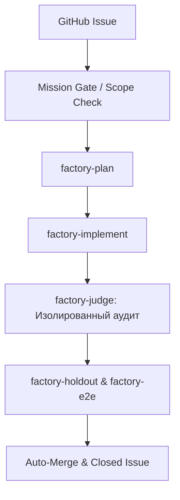

# 🏭 AI Software Factory

## Назначение
Автономный конвейер разработки программного обеспечения («Dark Factory» / беспилотная фабрика софта).
Принимает задачу в виде GitHub Issue, верифицирует против `MISSION.md`, строит план, реализует код, тестирует через независимый `Judge` и скрытые тесты `Holdout E2E`, и вливает результат без ручной вычитки диффов.

## Архитектура конвейера (Pipeline)



## Ключевые компоненты
1. **`MISSION.md`**: Что продукт делает и список вещей, чем он **никогда** не должен стать (Never-Build List для защиты от расползания скоупа).
2. **`harness/END-TO-END.md`**: Пользовательские сценарии (User Journeys) реального использования.
3. **`.factory/holdout/HOLDOUT.md`**: Скрытые инварианты и проверочные тесты, которые агент-строитель не может прочитать во время кодинга.
4. **Ролевая изоляция**: Судья (`factory-judge`) никогда не пишет код; Строитель (`factory-implement`) никогда сам себе не ставит оценку.

## Команды управления
- **Инициализация в проекте:**
  ```bash
  python skills/public/dev/ai-software-factory/bin/factory.py init
  ```
- **Проверка готовности (Pre-Flight Check):**
  ```bash
  python factory/doctor.py
  ```
- **Запуск цикла:**
  ```bash
  python skills/public/dev/ai-software-factory/bin/factory.py run
  ```

## Вложенные специализированные навыки (`template/.claude/skills/`)
- `factory-setup` — первичное интервью и подготовка 3 базовых файлов.
- `factory-prime` — загрузка контекста репозитория.
- `factory-plan` — декомпозиция задачи в план изменений.
- `factory-implement` — изолированное написание кода.
- `factory-judge` — беспристрастное ревью результата внешней моделью.
- `factory-review` — аудит качества и безопасности.
- `factory-fix` — точечное исправление замечаний судьи.
- `factory-holdout` & `factory-e2e` — запуск скрытых e2e проверок.
- `factory-triage` — маршрутизация входящих тикетов.
