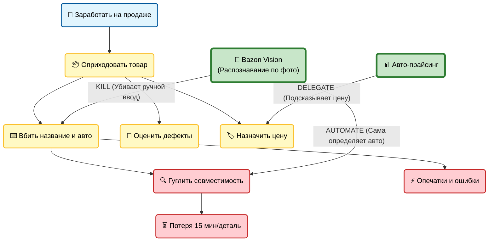

# Пример Графа Работ: Прием нового товара (Bazon)

Этот пример показывает, как применить AJTBD к процессу приемки товара на складе (Аватар 4).

## Контекст
Руководитель склада хочет оприходовать новую партию запчастей (бамперы, фары), чтобы быстрее выставить их на продажу.

## Анализ
1.  **Meta Job:** Заработать деньги на продаже запчастей.
2.  **Core Job:** Оприходовать товар на склад.
3.  **Micro-Jobs (Steps):**
    -   Найти накладную.
    -   Вбить название детали.
    -   Определить, от какой машины (по году/кузову).
    -   Оценить состояние (дефекты).
    -   Сфотографировать.
    -   Назначить цену.
4.  **Проблемы (Tax Jobs):**
    -   Ручной ввод длинных названий (Ошибки, Время).
    -   Поиск в интернете, чтобы понять, от какой машины деталь (Потеря фокуса).
    -   Вспоминание цены закупки (Нагрузка на память).

## Решение (Value Creation)
-   **Automate:** Распознавание детали и авто по фото.
-   **Kill:** Ручной ввод названия.
-   **Delegate:** Оценку рыночной цены (ИИ подсказывает среднюю по рынку).

## Визуализация (Mermaid)

