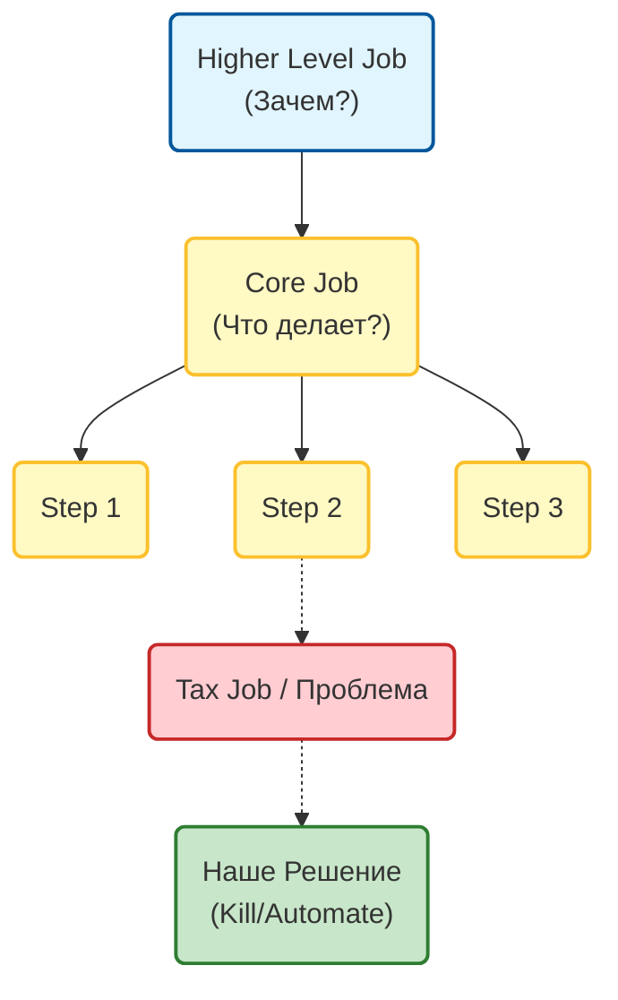

# Шаблон Графа Работ (Mermaid)

Скопируйте этот код и заполните своими данными.

```mermaid
graph TD
    %% Стили
    classDef value fill:#e1f5fe,stroke:#01579b,stroke-width:2px;
    classDef job fill:#fff9c4,stroke:#fbc02d,stroke-width:2px;
    classDef problem fill:#ffcdd2,stroke:#c62828,stroke-width:2px;
    classDef solution fill:#c8e6c9,stroke:#2e7d32,stroke-width:2px;

    %% Узлы (Nodes)
    MetaJob("Higher Level Job<br/>(Зачем?)"):::value
    CoreJob("Core Job<br/>(Что делает?)"):::job
    
    %% Декомпозиция
    Step1("Step 1"):::job
    Step2("Step 2"):::job
    Step3("Step 3"):::job
    
    %% Проблемы (Tax Jobs)
    Tax1("Tax Job / Проблема"):::problem
    
    %% Решения (Value Creation)
    Solution1("Наше Решение<br/>(Kill/Automate)"):::solution

    %% Связи
    MetaJob --> CoreJob
    CoreJob --> Step1
    CoreJob --> Step2
    CoreJob --> Step3
    Step2 -.-> Tax1
    Tax1 -.-> Solution1
```
